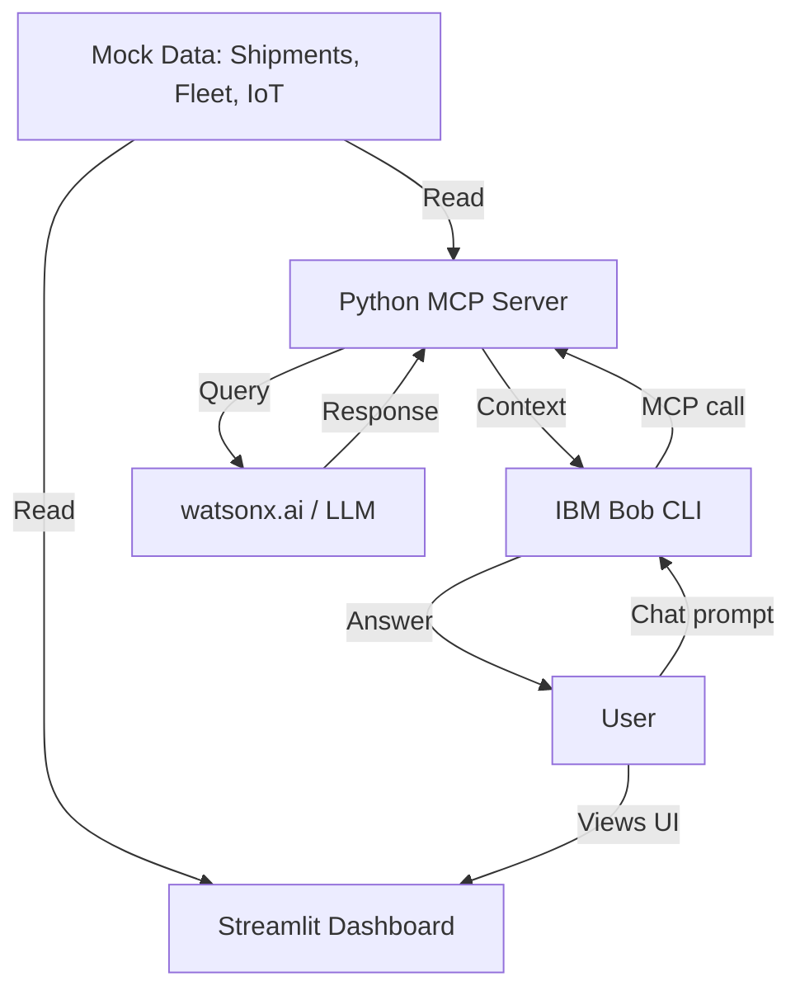

# Architecture

Our architecture is designed to be minimal, leveraging Python for both the frontend dashboard and the backend AI integration.

## Component Breakdown

| Component | Technology | Responsibility |
|---|---|---|
| **Dashboard** | Streamlit (Python) | Provides a visual overview of shipments, disruptions, and IoT alerts. |
| **Backend / API** | Python MCP Server | Processes raw JSON data, runs disruption logic, and exposes endpoints. |
| **AI Assistant** | IBM Bob CLI | Connects to the MCP server to answer natural language queries. |
| **Environment** | `python-dotenv` | Manages configuration and secrets safely. |

## Data Flow

