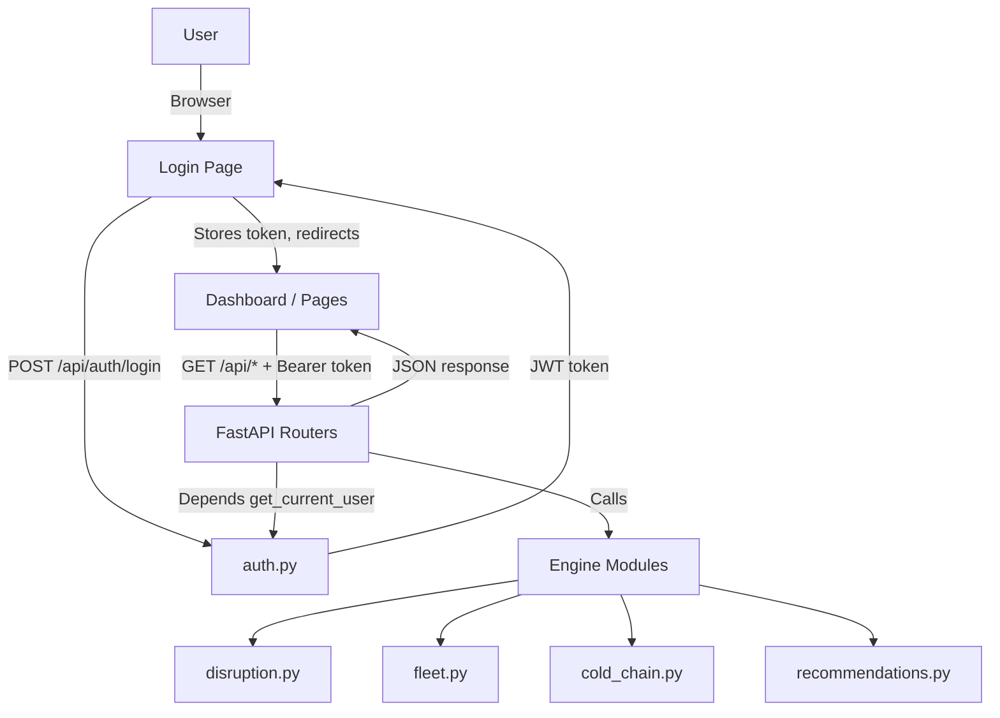

# Architecture

Our architecture is minimal — Python backend, React frontend, no database.

## Component Breakdown

| Component | Technology | Responsibility |
|---|---|---|
| **Dashboard** | React 18 + Vite (JSX) | Visual overview of shipments, disruptions, fleet, cold chain |
| **API** | FastAPI (Python) | Serves JSON data, runs engine logic, handles CORS |
| **Auth** | `python-jose` + `passlib` | JWT token issuance and verification, bcrypt password hashing |
| **Engine** | Pure Python modules | Disruption detection, fleet matching, cold chain severity |
| **Data** | Mock JSON files | Realistic supply chain fixtures — no DB required |
| **Config** | `python-dotenv` | Manages environment variables (JWT secret, CORS origin) |

## Auth Flow

```
User (browser)
  │
  ├─ POST /api/auth/login {username, password}
  │       │
  │       └─ auth.py: verify bcrypt hash → sign JWT → return access_token
  │
  ├─ GET  /api/shipments
  │   Authorization: Bearer <token>
  │       │
  │       └─ get_current_user() dependency → decode JWT → allow or 401
  │
  └─ Sign Out → localStorage.removeItem('token') → redirect /login
```

## Data Flow



## Port Mapping

| Service | Port |
|---|---|
| FastAPI backend | `8000` |
| React frontend (Vite dev) | `5173` |
