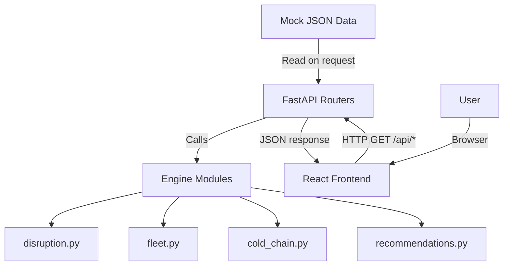

# Architecture

Our architecture is minimal — Python backend, React frontend, no database.

## Component Breakdown

| Component | Technology | Responsibility |
|---|---|---|
| **Dashboard** | React 18 + Vite (JSX) | Visual overview of shipments, disruptions, fleet, cold chain |
| **API** | FastAPI (Python) | Serves JSON data, runs engine logic, handles CORS |
| **Engine** | Pure Python modules | Disruption detection, fleet matching, cold chain severity |
| **Data** | Mock JSON files | Realistic supply chain fixtures — no DB required |
| **Config** | `python-dotenv` | Manages environment variables safely |

## Data Flow

## Port Mapping

| Service | Port |
|---|---|
| FastAPI backend | `8000` |
| React frontend (Vite dev) | `5173` |
