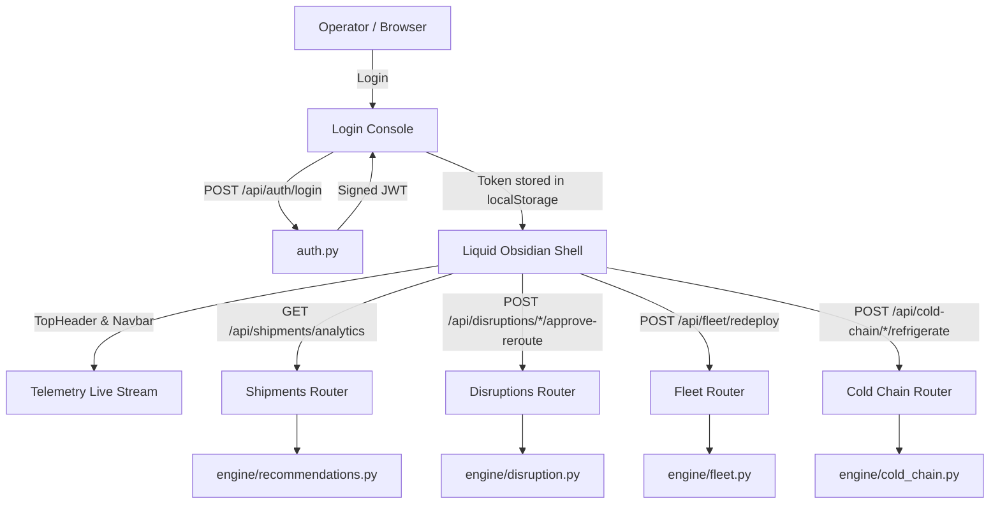

# Architecture

Our architecture is a decoupled, high-performance operational telemetry system — Python FastAPI backend with modular engine computation and React 18 frontend adhering to the Liquid Obsidian executive design system.

## Component Breakdown

| Component | Technology | Responsibility |
|---|---|---|
| **Executive Console** | React 18 + Vite (JSX) | Liquid Obsidian glassmorphic telemetry grid, spatial monitoring, real-time filters |
| **API Layer** | FastAPI (Python) | High-throughput REST API with live endpoints for rerouting, dispatch, and telemetry |
| **Auth** | `python-jose` + `passlib` | JWT token issuance and verification, bcrypt password hashing |
| **Engine Core** | Pure Python modules | Disruption matching, automated fleet capacity re-balancing, cold chain classification |
| **Data Fabric** | Mock JSON fixtures | Realistic supply chain entities with full roundtrip write-back persistence |
| **Config** | `python-dotenv` | Manages environment variables (JWT secret, CORS origin, frontend binding) |

## Auth Flow

```
User (browser)
  │
  ├─ POST /api/auth/login {username, password}
  │       │
  │       └─ auth.py: verify bcrypt hash → sign JWT → return access_token
  │
  ├─ GET  /api/shipments (or any protected endpoint)
  │   Authorization: Bearer <token>
  │       │
  │       └─ get_current_user() dependency → decode JWT → allow or 401
  │
  └─ Sign Out → localStorage.removeItem('token') → redirect /login
```

## Action & Telemetry API Matrix

| Endpoint | Method | Domain | Purpose |
|---|---|---|---|
| `/api/auth/login` | `POST` | Auth | Authenticates operator, issues signed JWT |
| `/api/shipments` | `GET` | Shipments | Lists all active corridor shipments |
| `/api/shipments/analytics` | `GET` | Shipments | Network SLA (99.98%), latency (14ms), carrier metrics |
| `/api/shipments/{id}/apply-reroute` | `POST` | Shipments | Directly executes AI alternate corridor bypass |
| `/api/disruptions` | `GET` | Disruptions | Surfaces active incidents with severity classification |
| `/api/disruptions/{id}/affected` | `GET` | Disruptions | Correlates affected shipments and delay deltas |
| `/api/disruptions/{id}/approve-reroute`| `POST` | Disruptions | 1-Click approval applying AI reroutes to impacted cargo |
| `/api/disruptions/{id}/dispatch-drivers`| `POST` | Disruptions | Pushes turn-by-turn bypass telemetry to driver terminals |
| `/api/disruptions/{id}/archive` | `POST` | Disruptions | Archives cleared incidents with meteorological log records |
| `/api/fleet` | `GET` | Fleet | Continental fleet asset tracking |
| `/api/fleet/redeploy` | `POST` | Fleet | Bulk redeployment of idle tonnage to congested hubs |
| `/api/fleet/auto-dispatch` | `POST` | Fleet | Autonomous re-balancing of surplus depot assets |
| `/api/fleet/{id}/assign` | `POST` | Fleet | Assigns custom corridor route and manifest to asset |
| `/api/fleet/{id}/gps` | `GET` | Fleet | Live GPS coordinates, speed, driver, and battery state |
| `/api/cold-chain/alerts` | `GET` | Cold Chain | Classifies excursions by FDA/regulatory 2h threshold |
| `/api/cold-chain/{id}/refrigerate` | `POST` | Cold Chain | Emergency cooling trigger: normalizes temp and resets breach |
| `/api/cold-chain/compliance-logs` | `GET` | Cold Chain | FDA 21 CFR Part 11 / EU GDP compliant exportable logs |

## Data Flow



## Port Mapping

| Service | Port | Protocol |
|---|---|---|
| FastAPI backend | `8000` | HTTP / JSON |
| React frontend (Vite dev) | `5173` | HTTP / HMR |
